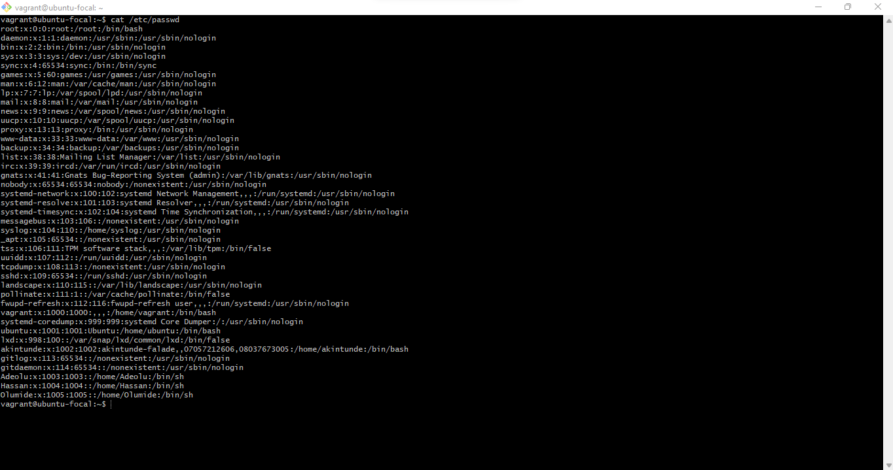
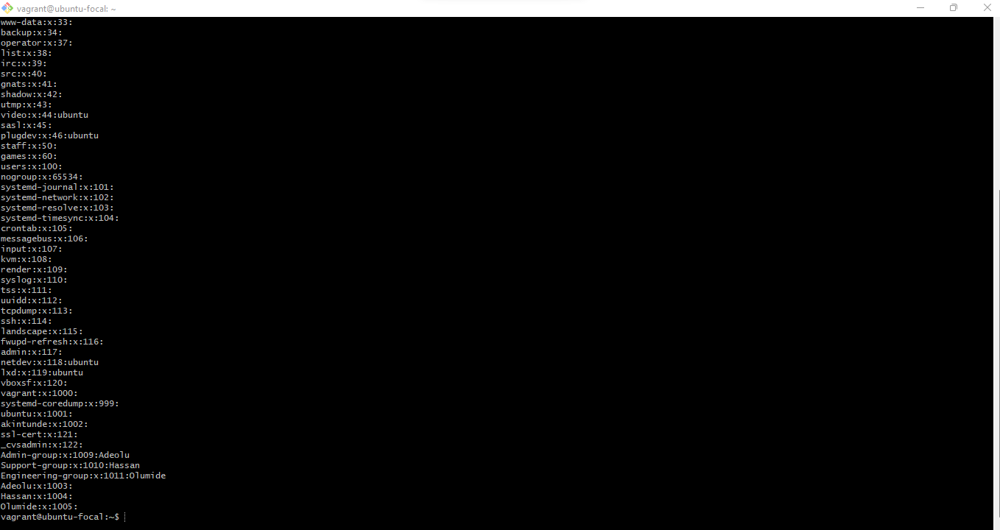

# Group, Users and SSH key commands

1. `etc-passwd` The image below shows the output of /etc/passwd

2. `etc-group` The image below shows the output of /etc/group

3. `etc-sudoers` The image below shows the output of /etc/sudoers
